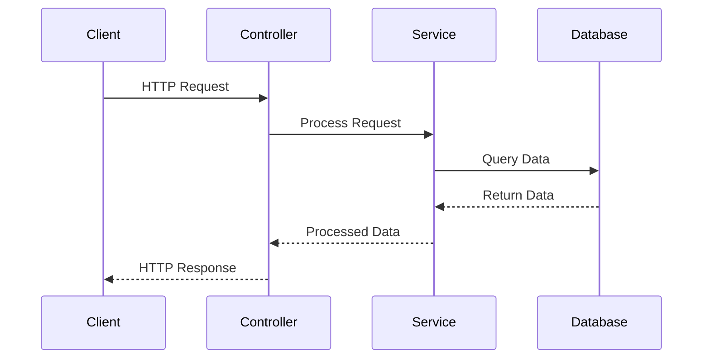
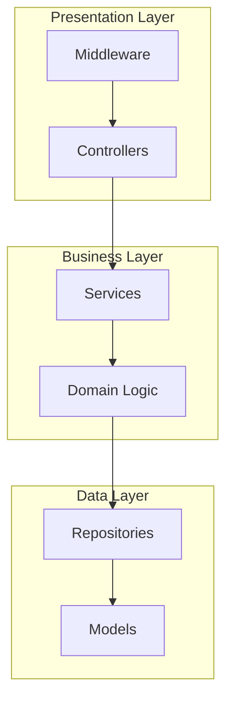

# Complete Architecture Documentation Generator - For Coding Agents

## Mission
Generate comprehensive architecture documentation for this codebase by installing and running madge, Arkit, and TypeDoc, then analyzing their outputs to create master documentation.

---

## Part 1: Setup & Tool Execution

### Step 1: Install Required Tools

```bash
npm install --save-dev madge arkit typedoc
```

Or if global installation is preferred:
```bash
npm install -g madge arkit typedoc
```

### Step 2: Create Directory Structure

```bash
mkdir -p arch-doc/{dependencies,architecture,api-docs,reports}
```

### Step 3: Execute Documentation Tools

**Important:** Replace `src/` with the actual source directory. For TypeScript projects, add `--ts-config tsconfig.json --extensions ts,tsx` to madge commands.

#### A. Run Madge (Dependency Analysis)

```bash
# Visual dependency graphs
madge --image arch-doc/dependencies/dependency-graph.png src/
madge --image arch-doc/dependencies/dependency-graph.svg src/

# Export dependency data
madge --json src/ > arch-doc/dependencies/dependencies.json
madge --circular --json src/ > arch-doc/dependencies/circular-dependencies.json
madge --list src/ > arch-doc/dependencies/module-list.txt
madge --summary src/ > arch-doc/dependencies/summary.txt
```

#### B. Run Arkit (Architecture Diagrams)

```bash
# Generate architecture diagrams
arkit -o arch-doc/architecture/architecture.svg
arkit -f png -o arch-doc/architecture/architecture.png
arkit -f puml -o arch-doc/architecture/architecture.puml
arkit -d 2 -o arch-doc/architecture/component-architecture.svg

# If specific directories exist, generate focused views
# arkit -o arch-doc/architecture/services-architecture.svg src/services/
# arkit -o arch-doc/architecture/components-architecture.svg src/components/
```

#### C. Run TypeDoc (API Documentation)

```bash
# Generate API documentation
typedoc --out arch-doc/api-docs/html src/
typedoc --json arch-doc/api-docs/api-model.json src/
```

---

## Part 2: Analysis & Documentation Generation

Now that all tools have run, read and analyze the following generated files:

### Files to Read:

1. **arch-doc/dependencies/dependencies.json** - Complete dependency tree
2. **arch-doc/dependencies/circular-dependencies.json** - Circular dependencies (if any)
3. **arch-doc/dependencies/module-list.txt** - All modules
4. **arch-doc/dependencies/summary.txt** - Dependency statistics
5. **arch-doc/api-docs/api-model.json** - Complete API structure

### Visual Artifacts to Reference:
- arch-doc/dependencies/dependency-graph.svg
- arch-doc/architecture/architecture.svg
- arch-doc/architecture/component-architecture.svg

---

## Part 3: Generate Master Documentation

### Document 1: `arch-doc/CODE-MAP.md`

Create a comprehensive code map (minimum 1500 lines) with the following structure:

#### Required Sections:

**1. Executive Summary**
- Project name, type, and purpose (2-3 paragraphs)
- Technology stack (languages, frameworks, libraries)
- Architecture style (microservices, monolith, modular, etc.)
- Key statistics in table format:
  - Total modules
  - Total source files
  - Total dependencies
  - Circular dependencies count
  - Average dependencies per module

**2. Table of Contents**
- Generate complete TOC with links to all sections

**3. Architecture Overview**
- Describe the high-level system architecture
- Identify architecture patterns (MVC, layered, hexagonal, etc.)
- List design patterns found (Factory, Singleton, Observer, etc.)
- Describe the architectural layers
- Include reference: ``

**4. Project Structure**
```
Use a tree structure with annotations:

src/
├── services/          # Business logic services
│   ├── auth/         # Authentication service
│   └── users/        # User management
├── models/           # Data models
├── controllers/      # Request handlers
└── utils/            # Shared utilities
```

**5. Module Map**

Create a table with ALL modules:

| Module | Purpose | Type | Dependencies | Dependents | Complexity |
|--------|---------|------|--------------|------------|------------|
| auth.service | User authentication | Service | 3 | 12 | Medium |
| user.model | User data structure | Model | 0 | 8 | Low |

Complexity scale: Low (0-2 deps), Medium (3-5 deps), High (6+ deps)

**6. Dependency Analysis**

- **Hub Modules** (most depended upon): List top 10 with count
- **Leaf Modules** (no outgoing dependencies): List all
- **Circular Dependencies**: 
  - If found, create a section with ⚠️ WARNING
  - List each circular dependency chain
  - Explain why it's problematic
  - Suggest refactoring approaches
- **Dependency Depth**: Calculate and explain max depth
- **Dependency Graph**: ``

**7. Component Architecture**

- Group modules by architectural layer (presentation, business, data, etc.)
- Describe responsibilities of each layer
- Show component relationships
- Include: ``

**8. API Surface**

From the TypeDoc JSON, extract and document:
- All exported classes (with descriptions)
- All exported functions (with signatures)
- All exported interfaces/types
- Main entry points
- Link to full docs: `[Full API Documentation](api-docs/html/index.html)`

**9. Entry Points & Data Flow**

- Identify application entry points (main files, index files)
- Describe initialization sequence
- Map request/data flow through the system
- Create a Mermaid sequence diagram for main flow:



**10. Critical Files**

List the most important files with explanations:
- Configuration files (package.json, tsconfig.json, etc.)
- Main application files
- Key business logic files
- Build/deployment files

**11. External Dependencies**

Analyze package.json and list:
- Production dependencies (grouped by category: framework, utilities, database, etc.)
- Development dependencies
- Dependency health (identify outdated packages)
- Security considerations

**12. Code Quality Assessment**

Based on dependency analysis:
- **High Coupling Areas**: Modules with too many dependencies
- **Potential Issues**: 
  - Circular dependencies
  - God objects (modules with too many dependents)
  - Orphaned modules
- **Technical Debt Indicators**
- **Recommendations**: Specific, actionable improvements

**13. Developer Guide**

- **How to Navigate**: Guide to finding specific functionality
- **Common Patterns**: Patterns used throughout the codebase
- **Adding New Features**: Where and how to add new code
- **Testing Strategy**: How tests are organized
- **Build Process**: How to build and run

**14. Mermaid Architecture Diagram**

Create a high-level Mermaid diagram summarizing the architecture:



**15. Quick Reference**

- Important commands table
- Key file paths
- Essential documentation links
- Troubleshooting tips

**16. Appendix**

- How to regenerate this documentation
- Tools used and their versions
- Last generated timestamp

---

### Document 2: `arch-doc/DEPENDENCY-REPORT.md`

Create a detailed dependency report:

**Structure:**

1. **Summary Statistics**
   - Total dependencies
   - Average dependencies per module
   - Max dependency depth
   - Dependency distribution chart (as table)

2. **Dependency Tree**
   - Complete dependency tree for top 10 modules
   - Show full chain of dependencies

3. **Circular Dependency Deep Dive**
   - For each circular dependency:
     - Show the cycle
     - Explain the problem
     - Suggest 3 refactoring approaches
     - Provide code example of fix

4. **Module Coupling Analysis**
   - Identify tightly coupled modules
   - Calculate coupling metrics
   - Suggest decoupling strategies

5. **Import/Export Analysis**
   - Most imported modules
   - Modules that export the most
   - Barrel file usage

6. **Dependency Health**
   - Identify single points of failure
   - Modules that are over-depended on
   - Unused dependencies (if detectable)

7. **Refactoring Roadmap**
   - Prioritized list of refactoring tasks
   - Expected impact of each
   - Estimated effort

---

### Document 3: `arch-doc/API-GUIDE.md`

Create a developer-friendly API guide:

**Structure:**

1. **Getting Started**
   - How to use the API
   - Authentication (if applicable)
   - Common setup

2. **Core APIs**
   - For each major API/module:
     - Purpose and usage
     - Code example
     - Common use cases
     - Related APIs

3. **Data Models**
   - Key interfaces and types
   - Relationships between models
   - Validation rules

4. **Common Patterns**
   - Patterns used across the API
   - Best practices
   - Anti-patterns to avoid

5. **Integration Examples**
   - Real-world usage examples
   - Complete workflows
   - Error handling examples

6. **Advanced Topics**
   - Performance considerations
   - Security best practices
   - Extension points

---

### Document 4: `arch-doc/README.md`

Create a navigation document:

```markdown
# Architecture Documentation

Last Generated: [timestamp]

## 📚 Documentation Index

- **[CODE-MAP.md](CODE-MAP.md)** - Comprehensive architecture overview
- **[DEPENDENCY-REPORT.md](DEPENDENCY-REPORT.md)** - Detailed dependency analysis  
- **[API-GUIDE.md](API-GUIDE.md)** - Developer API guide

## 📊 Generated Artifacts

### Dependency Analysis (Madge)
- [Dependency Graph (SVG)](dependencies/dependency-graph.svg)
- [Dependency Data (JSON)](dependencies/dependencies.json)
- [Circular Dependencies](dependencies/circular-dependencies.json)
- [Module List](dependencies/module-list.txt)

### Architecture Diagrams (Arkit)
- [System Architecture (SVG)](architecture/architecture.svg)
- [Component Architecture](architecture/component-architecture.svg)
- [PlantUML Diagram](architecture/architecture.puml)

### API Documentation (TypeDoc)
- [HTML Documentation](api-docs/html/index.html)
- [API Model (JSON)](api-docs/api-model.json)

## 🔄 Regenerating Documentation

To regenerate this documentation:

1. Install tools: `npm install --save-dev madge arkit typedoc`
2. Run commands from CODE-MAP.md appendix
3. Re-analyze with LLM

## 🛠️ Tools Used

- **Madge** - Dependency graphs and circular dependency detection
- **Arkit** - Architecture diagram generation  
- **TypeDoc** - API documentation from TypeScript

---

**Quick Start**: Begin with [CODE-MAP.md](CODE-MAP.md)
```

---

## Output Format Requirements

- **Use proper Markdown headers** (##, ###, ####) for navigation
- **Include Mermaid diagrams** where appropriate
- **Use tables** for structured data
- **Add code blocks** with proper syntax highlighting
- **Use relative links** for cross-references
- **Use emojis** sparingly for section headers (⚠️ 📊 🔄 etc.)
- **Bold important terms** on first use
- **Use blockquotes** for warnings and important notes

> ⚠️ **Note**: This is how to format important warnings

---

## Success Criteria

Documentation is complete when:

✅ All tools executed successfully  
✅ All 4 markdown documents created  
✅ CODE-MAP.md is comprehensive (1500+ lines)  
✅ All circular dependencies identified and explained  
✅ All generated files referenced with links  
✅ Mermaid diagrams included  
✅ Developer guide is actionable  
✅ Navigation between documents works  

---

## Important Notes

- If circular dependencies exist, they MUST be highlighted prominently
- All statistics should be in tables for readability
- Code examples should be realistic and helpful
- Focus on actionable insights, not just data dumps
- Assume readers are developers who will maintain this code

---

Begin execution and generate all documentation.
